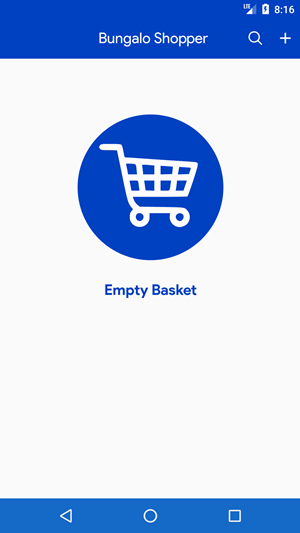
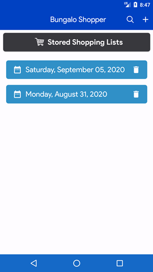

# BungaloShopper
This application was designed to create a simple shopping list to assist on visits to the store. The application uses the Room Database and LiveData.

## Initial Launch
The application opens with an empty list which will be updated as shopping lists are created. 



## Creating a shopping list
A shopping list can be created by clicking the plus icon on the app bar.


## Stored Shopping Lists
As items are added a list is popluated by date.




## View Shopping List
You can tap on one of the dates in the lists of dates to view the shopping list for that date


## List Filter
You can filter a shopping list by clicking of the search glass on the app bar


## Editing Day's Shopping List
You can remove and edit items from the shopping lists screen


## Remove Shopping List
You can also remove a day's shopping list all together from the main list.


## Gradle Dependency

The following `dependencies` should be added to the **build.gradle** app file:

```groovy
    // ViewModel
    implementation "androidx.lifecycle:lifecycle-viewmodel:$lifecycle_version"

    // LiveData
    implementation "androidx.lifecycle:lifecycle-livedata:$lifecycle_version"

    // Room
    implementation "androidx.room:room-runtime:$room_version"
    kapt "androidx.room:room-compiler:$room_version"

    // Coroutines
    implementation "org.jetbrains.kotlinx:kotlinx-coroutines-core:$coroutines_version"
    implementation "org.jetbrains.kotlinx:kotlinx-coroutines-android:$coroutines_version"
```

## License

    The MIT License (MIT)

    Copyright (c) 2020 Paul O. Patterson

    Permission is hereby granted, free of charge, to any person obtaining a copy
    of this software and associated documentation files (the "Software"), to deal
    in the Software without restriction, including without limitation the rights
    to use, copy, modify, merge, publish, distribute, sublicense, and/or sell
    copies of the Software, and to permit persons to whom the Software is
    furnished to do so, subject to the following conditions:

    The above copyright notice and this permission notice shall be included in all
    copies or substantial portions of the Software.

    THE SOFTWARE IS PROVIDED "AS IS", WITHOUT WARRANTY OF ANY KIND, EXPRESS OR
    IMPLIED, INCLUDING BUT NOT LIMITED TO THE WARRANTIES OF MERCHANTABILITY,
    FITNESS FOR A PARTICULAR PURPOSE AND NONINFRINGEMENT. IN NO EVENT SHALL THE
    AUTHORS OR COPYRIGHT HOLDERS BE LIABLE FOR ANY CLAIM, DAMAGES OR OTHER
    LIABILITY, WHETHER IN AN ACTION OF CONTRACT, TORT OR OTHERWISE, ARISING FROM,
    OUT OF OR IN CONNECTION WITH THE SOFTWARE OR THE USE OR OTHER DEALINGS IN THE
    SOFTWARE.
